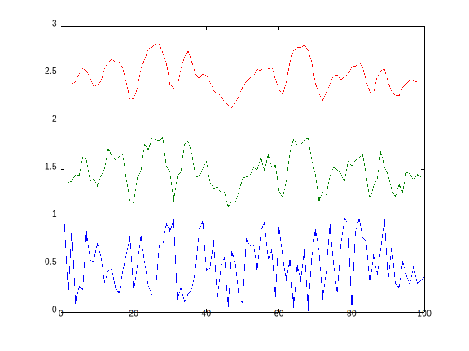

# 高階函數 #
這章蠻短的，沒什麼新東西，但一些程式寫得不好或有問題。
主要概念就是輸入一個函數，然後不斷執行直到條件滿足。
用來介紹數學上一些概念，可以簡單透過 *把函數當參數* 表達。

後來把 1-3-5 也寫進來，
因為有用到重覆的函數 fixed-point。
就變很長了 `@@`

### 抽像化測試條件
這類函數至少有三個參數，要運行的函數、初始值、條件。
sicp 中條件是給容許誤差，但之前某單元有做過類似的事，
有時用固定的誤差不太準，但改成比例誤差也會遇到例外。
我是寫成讓使用者輸入一個判斷函數，
自己判斷條件滿足了沒。

結果多數情況還是容許誤差已夠用，
只好再寫一個函數輸入容許誤差，
會返回判斷二數間距是否小於容許誤差函數的函數 `orz`

## search
因多項式為線性，故若 `f(a)` 為正且 `f(b)` 為負，
則至少存在一根 c 介於 a b 間。
於是就一直分成二區間，然後測試根在哪一區間，
直到區間 `|a-b|` 小於容許誤差，就返回 c。

這程式只能解出在 a b 區間中的一根，
如果有多個根會被忽略。

sicp 中把 `postive?` 和 `negative?` 獨立出來，
沒有直接在 `cond` 用 `<` `>` 比，
我還以為之後要在這上面做文章，
所以獨立出來重寫，結果也沒有。

## fixed-point
好像就翻不動點？
[[lambda 演算]] 中好像有同名的東西，
又叫 **Y combinator** 。

她的概念是要求 `f(x) = x` ，
作法則是直接不斷把 x 輸入到 f 函數，
然後再用輸出當下一個 x。
如果 f 收斂是可以啦，
但絕大多數的函數都不會收斂吧ㄎㄎ

### 管道
以前初入 lisp 系語言時寫過類似的幾個東西：

  - 管道：輸入多個函數 a b c d，返回一個函數 f，
    呼叫 f(x) 等同呼叫 d(c(b(a(x)))) 。
  - 重覆呼叫：輸入函數 f 和要求次數 n，
    返回一個函數 g，g(x) 等同對 x 不斷呼叫 f n 次。

原本 x 也是輸入，後來才由 curry 想到
其實可以直接返回包好的函數，方便多次調用。
另外原本第二個 *重覆呼叫* 是把 f 串成要求長度的 list，
再丟到第一個 *管道* 裡實作的 `;)`

那時候就寫了幾個簡單的函數，試試串起來會發生什麼事。
（像 `log` 、`*3` 、`+7` 之類的。）
結果好像因為串了 log，竟然會趨近某一值 `@@`

## 改寫迴圈與尾端遞迴
有幾題要求如果是用迴圈寫，
就改寫成尾端遞迴；反之亦同。
一開始還會寫，後來覺得其實沒什麼難度。
我是會要求自己儘量用尾端遞迴實作，
感覺再改回迴圈就沒什麼難度。
後面就有點懶得寫。

## 浮點數與整數轉換
sicp 還沒介紹轉換，
只簡單介紹只要是整數與浮點數的運算，
結果就會用浮點數表示。
有幾題程式比較複雜，
我竟然不能簡單看出來，放了浮點數初始值後，
會不會 *感染* 到所有結果。

結果試了，有成功，
只是懶得人腦 compile 驗證邏輯。

## cont-frac
這題是解 [[連分數]] (continued fraction) ，
寫得時候發現不能優雅的寫成尾端遞迴，
之後看了別人的 code 也是不怎麼優雅，
都是把上一步算好的結果再乘開，
再加這一步再除回去。自己也想不到更好的作法。
如果用分數不用浮點數，是不是就沒差，不會造成誤差了？

最後還沒有寫完，
發現還要考量第 1 層沒有上一步的情況。
太麻煩不想寫。

## tan-cf
最後一題模擬 tan 就很簡單，
要把連分數變號直接加減號就可以，
沒有特殊情況要處理 ^^

## 尾端遞迴優化條件
有時函數會用到重複的值，
需要先用 `let` 把結果存起來。
那這樣函數最後一個 statement 就變成 let，
而不是呼叫自己，這樣還能優化嗎？

如果 scheme 有實作所有尾呼叫的消除，
（在執行尾呼叫時移除 stack 上原本的 function。）
且對尾遞迴沒有特別再優化，那用 let 應該沒差；
只要 let 內仍是尾呼叫自己。

從第一章有介紹的執行順序，
看起來 lisp 和 scheme 直譯器都是先對所有參數求值，
再把 function call 取代為 function 內容。
天生具有尾消除的特性。
例如：

    (add-3-multiply-4 (+ 4 7))
    (add-3-multiply-4 11)
    (* 4 (+ 3 11))

但某些語言，因為方便只會消除對自己的尾呼叫，
（對自己的呼叫只要改參數內容，其它都一樣不用動。）
所以遇到間接遞迴就沒辦法消除。
其實 let 有點像間接遞迴，先呼叫 let，let 再呼叫原函數。

不過爬了 scheme 的標準 [r6rs][] ，
好像有寫明哪些情況是尾呼叫，
包括 let 內的最後一個陳述也算尾呼叫；那就是可以吧。

[r6rs]: http://www.r6rs.org/final/html/r6rs/r6rs-Z-H-14.html#node_sec_11.20

## average-damp
有時候 fixed-point 不收斂，可以改一下函數讓他收斂，
於是創造了一個函數 average-damp，會去 *裝飾* 一個函數，
把他的輸出結果和輸入平均後再輸出。
經過裝飾過的函數大多收斂了。

## newtons-method
實作牛頓法蠻有趣的，還先實作了微分 `XD`
然後實作一個 `cubic` 函數，可以輸入係數產生三次多項式，
再用牛頓法解該多項式的根。

## double
double 就是輸入一個函數，返回一個新的，
會對輸入 apply 二次原函數的函數。
題目弄了 `((double (double double)) f)` ，
我一開始還想錯，以為只會做 8 次，
結果是 16 次，應該是用 `(2^2)^2` 在成長的。

## compose 和 repeated
題目提示 repeated 可以用 compose 實作，
但我看不出兩者關連在哪 orz

compose 蠻簡單的，因為要組合的函數固定二個，
直接寫死在 code 裡就好。

repeated 就得要用迴圈或遞迴。
用迴圈本來就要二個變數，counter 和 result，
所以把初始值當 result 傳進去就好。
用遞迴要嘛把初始值用閉包進去，
要嘛多開一個參數放初始值；如果要用閉包，
要把 recur 定義在回傳的 lambda 裡面，
會太醜就沒用。

## smooth
這東西蠻有趣的，原來和諧函數這樣寫。
但題沒給測試用 sample，也不知道對不對 `:'(`
只好自幹一個。

用 octave 產了一堆隨機數存到檔案，
再用 emacs 丟到 scheme repl 裡，
smooth 完二次後丟回 octave 繪圖。

用那種不嚴謹方式 smooth 果然可以從
garbage 裡生出看似有用的 garbage `XD`

後來覺得用 octave 太不 scheme 了，
於是寫了 scheme 版的隨機數生產。
但 scheme 不能繪圖，
還是得丟到 octave 或 gnuplot 畫 `:'(`

## nth-root
這題說到如果要開方的次數大，
也就是不動點變成 `(lambda (y) (/ x (expt y n)))` ，
只用一次 `average-damp` 會不夠。
要我們用 `repeated` 重覆 average-damp 加速收斂。

我也不知道怎麼測，
就改成要手動輸入要執行不動點幾次，
然後每次都把結果印出來，
再看有沒有收斂。

三次方根 damp 二次就夠，
四次方根要 damp 三次，
但也找不太出規律。

## iterative-improve
其實和之前我定義的 `fixed-point` 差不多，
只是把 test 獨立出來成一個函數；
但我的 fixed-point 本來就是用獨立的 test 函數。
另外我的 test 函數是比較二次的結果，
但感覺題目的 iterative-improve 是只給 test 一個參數，
和我的 fixed-point 又有點差。
